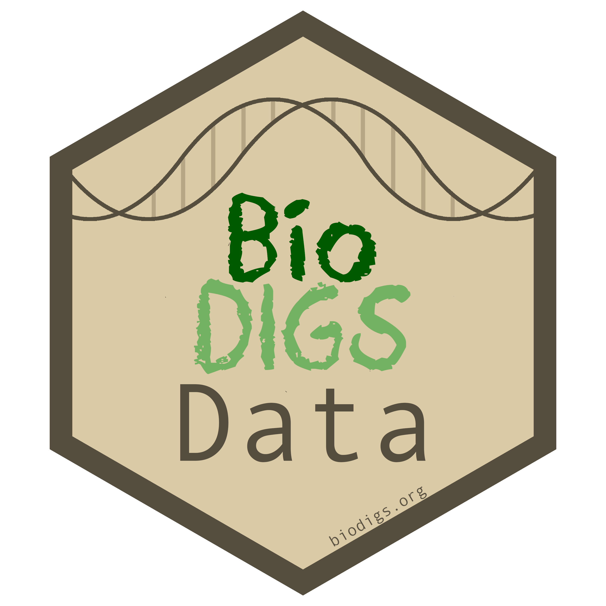

# BioDIGSData

We've created a data package to help you easily bring BioDIGS soil data and metadata into R! This package is currently in development, so if there's a feature you'd like to see, please let us know!

## Installation 

Install the package by running the following in R. You might need to install the devtools package.

```
devtools::install_github("fhdsl/BioDIGSData")
```

## Usage

Bring in the data using predefined functions. For example:

```
# Load soil data
my_data <- BioDIGSData::BioDIGS_soil_data()
```
